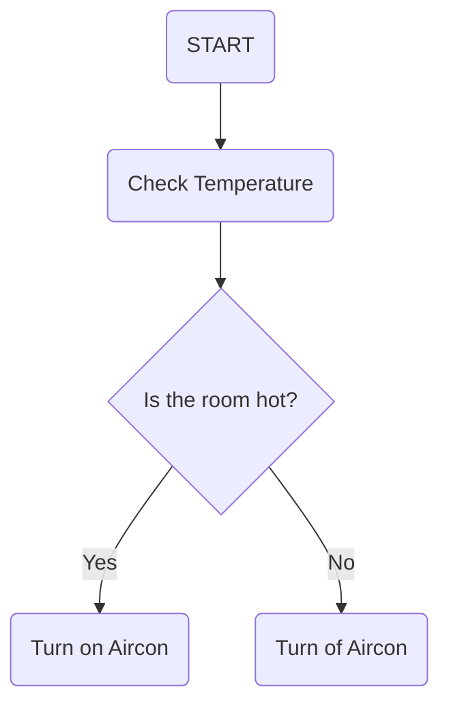

# Industri-Fagskolen

# Test
* Dette ser ut til å fungere

```Csharp
btest := TRUE;
IF TRUE THEN
	FALSE;
END_IF;
````
## FLow chart test


## Structured text test
```iecst
//Testing IF statement
IF _bTest THEN
	_bTest := FALSE;
END_IF;
```

