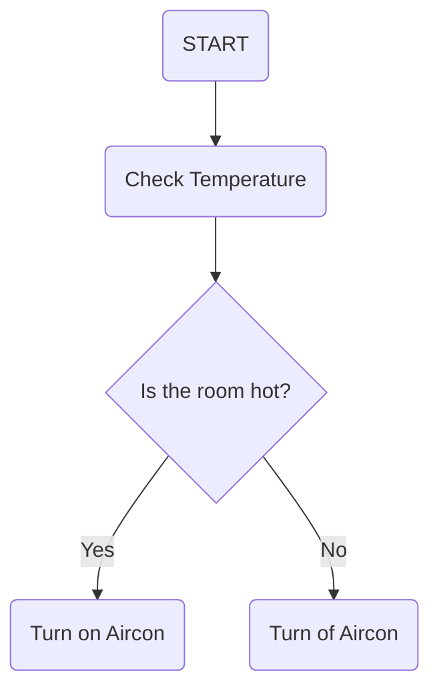

# IndustriFagskolen

## Test
* Dette ser ut til å fungere


<!-- @import "[TOC]" {cmd="toc" depthFrom=1 depthTo=6 orderedList=false} -->

<!-- code_chunk_output -->

- [IndustriFagskolen](#-industrifagskolen-)
  - [Test](#-test-)
  - [FLow chart test](#-flow-chart-test-)
  - [Structured text test](#-structured-text-test-)

<!-- /code_chunk_output -->


```Csharp
btest := TRUE;
IF TRUE THEN
	FALSE;
END_IF;
````
## FLow chart test


## Structured text test
```iecst
//Testing IF statement
IF _bTest THEN
	_bTest := FALSE;
END_IF;
```

```wavedrom
{signal: [
	{
		name: 'scl',
		wave: '1.01010101010'
	}
]}