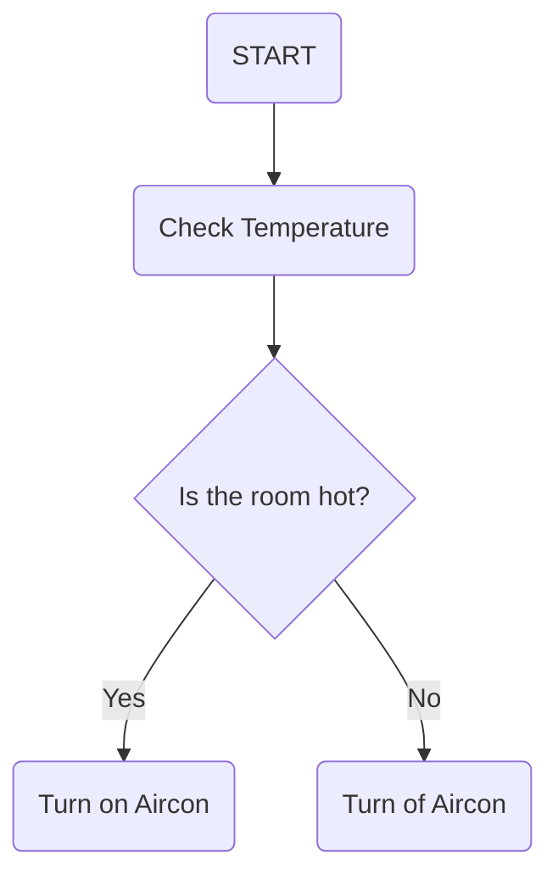

# Industri-Fagskolen

# Test
* Dette ser ut til å fungere

```Csharp
btest := TRUE;
IF TRUE THEN
	FALSE;
END_IF;
````


```mermaid
graph TD
A(START) --> B(Check Temperature);
B-->C{Is the room hot?};
C-->|Yes|D(Turn on Aircon);
C-->|No|E(Turn of Aircon);
```